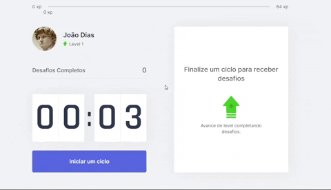

# 

<center ></center>

## 📒 Sobre o Moveit
  O Moveit foi um projeto desenvolvido durante o evento NLW4 da Rocketseat, é
  uma aplicação com foco em ajudar pessoas que passam a maior parte do seu tempo 
  na frente do computador. O Moveit oferece um sistema de Nível, sendo assim cada
  vez em que o usuário cumprir um desafio ele irá ganhar experiência para assim
  subir de nível, deixando o aplicativo mais empolgante!
  
## ✔️ Level Up
  <p>Tela de Level Up que aparece para o usuário.</p>
  

## 🌟 Tecnologias Usadas
  Essa aplicação foi desenvolvida com as seguintes tecnologias:
  
  - [React](https://reactjs.org/)
  - [Next.js](https://nextjs.org/)

## 💾 Instalando os Programas Necessários
  Para instalar os programas use esse comando:
  ```
  yarn
  ```
  - Caso não tenha o yarn siga o passo a passo de como instalar no seguinte link: https://classic.yarnpkg.com/en/docs/install/#windows-stable)

  Para iniciar o projeto no navegador utilize este comando:
  ```
  yarn dev
  ```
